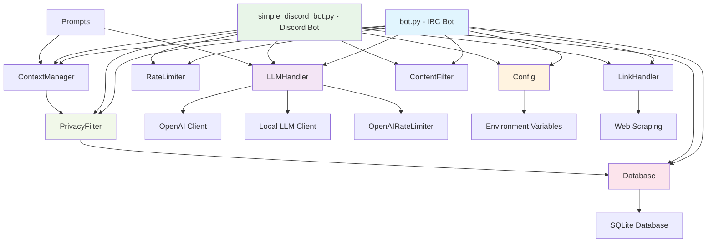
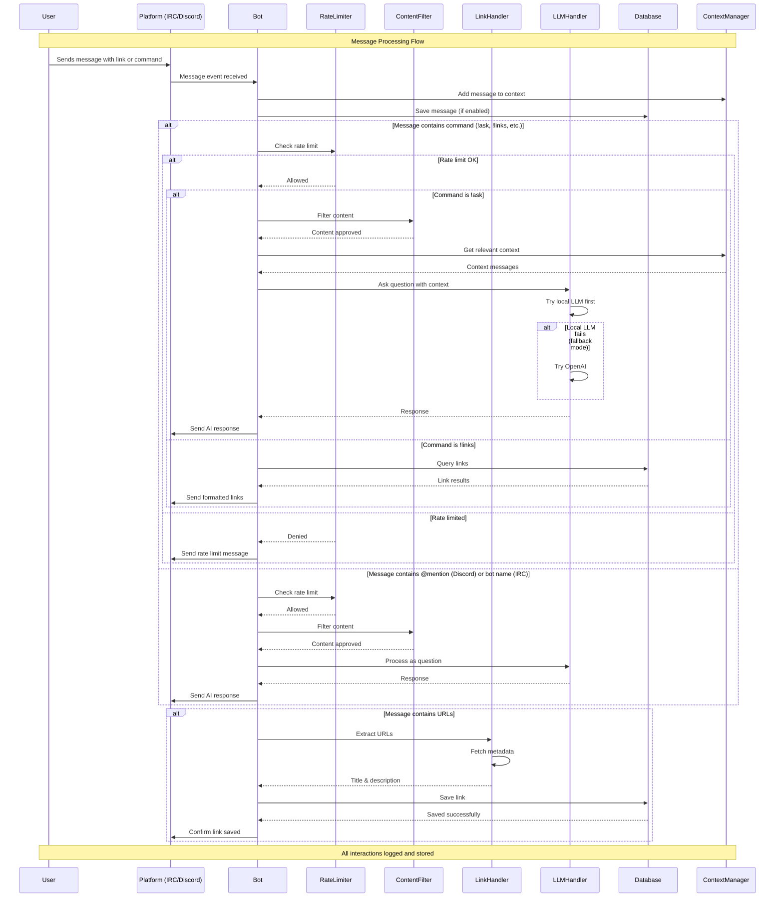

# AircBot

An intelligent IRC/Discord bot that automatically saves shared links and provides natural language interaction through LLM integration. Features smart link management, conversational AI responses, and comprehensive performance monitoring.

## Features

- **Multi-Platform Support**: Works on both IRC and Discord
- **Automatic Link Detection**: Monitors channels for links and saves them automatically
- **Link Metadata**: Automatically fetches and stores link titles and descriptions  
- **Smart Deduplication**: Avoids saving duplicate links
- **Command Interface**: Traditional !commands for link management
- **Natural Language**: Responds to natural mentions and direct messages
- **LLM Integration**: Answers questions using locally hosted LLM (Ollama/OpenAI-compatible)
- **Smart Response Validation**: Filters complex responses for platform-appropriate simple answers
- **Intelligent Retry Logic**: Automatically retries empty LLM responses (configurable attempts)
- **SSL Support**: Connects to IRC servers with SSL (including self-signed certificates)
- **Memory System**: Maintains conversation context for better LLM responses
- **Rate Limiting**: Prevents spam with configurable per-user and total request limits
- **Performance Monitoring**: Tracks LLM response times and success rates
- **Robust Logging**: Detailed connection and error logging without channel spam
- **Privacy Protection**: Advanced privacy filter that anonymizes usernames and removes PII before sending context to LLMs
- **Comprehensive Testing**: Clean test suite with full coverage of all functionality

## Quick Start

### IRC Bot
1. **Install dependencies:**
   ```bash
   ./start.sh  # This will set up everything automatically
   ```
   Or manually:
   ```bash
   python3 -m venv venv
   source venv/bin/activate
   pip install -r requirements.txt
   ```

2. **Configure the bot:**
   ```bash
   cp .env.example .env
   # Edit .env with your IRC server details
   ```

3. **Test the bot (optional):**
   ```bash
   ./run_tests.sh                # Run complete consolidated test suite (recommended)
   python -m pytest test_consolidated.py -v  # Run tests with verbose output
   python demo.py                # Run interactive demo of privacy & admin features
   ```

4. **Run the bot:**
   ```bash
   ./start.sh  # Or: source venv/bin/activate && python bot.py
   ```

### Discord Bot
1. **Set up Discord application:**
   - Go to [Discord Developer Portal](https://discord.com/developers/applications)
   - Create a new application and bot
   - Copy the bot token
   - Enable "Message Content Intent" in Bot settings

2. **Install dependencies:**
   ```bash
   python3 -m venv venv
   source venv/bin/activate
   pip install -r requirements.txt
   ```

3. **Configure the bot:**
   ```bash
   # Add to your .env file:
   DISCORD_TOKEN=your_bot_token_here
   ```

4. **Invite bot to server:**
   - Generate an invite link with these permissions:
     - Send Messages
     - Read Message History
     - Use Slash Commands (optional)
   - Invite the bot to your Discord server

5. **Run the Discord bot:**
   ```bash
   ./start_discord.sh  # Or: source venv/bin/activate && python simple_discord_bot.py
   ```

## Privacy Protection

AircBot includes an advanced privacy filter to protect user information when sending conversation context to LLMs. The privacy filter:

- **Anonymizes usernames** while preserving conversation flow
- **Removes PII** including emails, phone numbers, IPs, SSNs, and credit cards
- **Handles mentions and addressing** (e.g., "@john" becomes "@user_1")
- **Preserves common words** to avoid breaking normal conversation
- **Optimizes for channel size** with configurable performance thresholds
- **Maintains conversation context** so LLMs can still provide relevant responses

The privacy filter is enabled by default and works transparently. For complete documentation, configuration options, and examples, see the **[Privacy Filter Guide](PRIVACY_FILTER_GUIDE.md)**.

## Configuration

Edit the `.env` file with your settings:

### IRC Settings
- `IRC_SERVER` - IRC server address (default: irc.libera.chat)
- `IRC_PORT` - IRC server port (default: 6667)  
- `IRC_NICKNAME` - Bot's nickname
- `IRC_CHANNEL` - Channel to join (include # prefix)
- `IRC_PASSWORD` - Bot's password (if required)
- `IRC_USE_SSL` - Enable SSL connection (true/false)
- `IRC_SSL_VERIFY` - Verify SSL certificates (false for self-signed)

### Discord Settings
- `DISCORD_TOKEN` - Your Discord bot token (required for Discord bot)
- `DISCORD_GUILD_ID` - Optional: Specific server ID to restrict bot to
- `DISCORD_CHANNEL_ID` - Optional: Specific channel ID to restrict bot to

### LLM Settings (for !ask command and mentions)

The bot supports three different LLM modes for maximum flexibility:

#### LLM Mode Configuration
- `LLM_MODE` - Controls which AI service to use:
  - `local_only` - Use only local AI (Ollama) 
  - `openai_only` - Use only OpenAI API
  - `fallback` - Try local AI first, fall back to OpenAI if local fails or gives poor response

#### Local LLM Settings (Ollama)
- `LLM_ENABLED` - Enable local LLM features (true/false)
- `LLM_BASE_URL` - API endpoint (e.g., http://localhost:11434/v1 for Ollama)
- `LLM_API_KEY` - API key (use "ollama" for local Ollama)
- `LLM_MODEL` - Model name (e.g., deepseek-r1:latest)
- `LLM_MAX_TOKENS` - Maximum response length (default: 150)
- `LLM_TEMPERATURE` - Creativity level 0.0-1.0 (default: 0.7)
- `LLM_RETRY_ATTEMPTS` - Number of retries for empty LLM responses (default: 3)

#### OpenAI Settings

**🔐 IMPORTANT: For security, set your OpenAI API key in your shell environment:**
```bash
export OPENAI_API_KEY="sk-your-api-key-here"
```

The bot automatically detects and uses your environment `OPENAI_API_KEY`. No need to put it in config files!

- `OPENAI_ENABLED` - Enable OpenAI API features (auto-enabled when API key is found)
- `OPENAI_MODEL` - OpenAI model to use (e.g., gpt-3.5-turbo, gpt-4)
- `OPENAI_MAX_TOKENS` - Maximum response length for OpenAI (default: 150)
- `OPENAI_TEMPERATURE` - Creativity level for OpenAI 0.0-1.0 (default: 0.7)
- `OPENAI_DAILY_LIMIT` - Maximum OpenAI API calls per day for cost control (default: 100)

#### Mode Examples

**Local Only Mode** (default):
```bash
LLM_MODE=local_only
LLM_ENABLED=true
OPENAI_ENABLED=false
```

**OpenAI Only Mode**:
```bash
LLM_MODE=openai_only
LLM_ENABLED=false
OPENAI_ENABLED=true
OPENAI_API_KEY=your_api_key_here
```

**Fallback Mode** (best of both worlds):
```bash
LLM_MODE=fallback
LLM_ENABLED=true
OPENAI_ENABLED=true
OPENAI_API_KEY=your_api_key_here
```

In fallback mode, the bot will:
1. Try local AI first (faster, free, private)
2. If local AI fails or gives a poor response (e.g., "I don't know"), automatically fall back to OpenAI
3. Provides detailed logging so you can see which service handled each request

### Database
- `DATABASE_PATH` - Path to SQLite database file

### Rate Limiting  
- `RATE_LIMIT_USER_PER_MINUTE` - Max requests per user per minute (default: 1)
- `RATE_LIMIT_TOTAL_PER_MINUTE` - Max total requests per minute (default: 10)

### Privacy Protection
- `PRIVACY_FILTER_ENABLED` - Enable privacy filtering for LLM context (default: true)
- `PRIVACY_CHANNEL_SIZE_THRESHOLD` - Max channel size for full privacy filtering (default: 50)
- `PRIVACY_PRESERVE_COMMON_WORDS` - Preserve common words when anonymizing (default: true)
- `PRIVACY_USERNAME_PREFIX` - Prefix for anonymized usernames (default: "user_")

### Administrative Settings
- `ADMIN_USERS` - Comma-separated list of admin usernames who can use admin commands (default: bot nickname)

## Commands

Both IRC and Discord versions support the same command set:

### Traditional Commands
- `!links` - Show recent links
- `!links search <term>` - Search saved links by keyword
- `!links by <user>` - Show links shared by specific user (IRC only)
- `!links stats` - Show link statistics 
- `!links details` - Show recent links with timestamps (IRC only)
- `!ask <question>` - Ask the LLM a question
- `!privacy` - Show privacy filter status
- `!privacy test <message>` - Test privacy filter on a message
- `!privacy clear` - Clear your anonymization mappings (admin only)
- `!ratelimit` - Show rate limit status (IRC only)
- `!performance` - Show LLM performance stats (IRC only)
- `!bothelp` - Show help information (Discord) / `!help` (IRC)

### Natural Language

**IRC (Bot Mentions):**
You can mention the bot by name and ask naturally:
- `<ircnick>, show me the links` → Shows recent links
- `aircbot what links do you have?` → Shows recent links  

**Discord (Direct Mentions):**
Use @mentions or direct messages:
- `@aircbot show me the links` → Shows recent links
- `@aircbot what's the weather like?` → Asks LLM
- Direct message the bot for private conversations

The IRC bot responds to: ircnick, `aircbot` (case-insensitive, with word boundaries)

## Database Schema

The bot creates these tables:

### links
- `id` - Primary key
- `url` - The saved URL
- `title` - Page title
- `description` - Page description
- `user` - Who shared the link
- `channel` - Which channel it was shared in
- `timestamp` - When it was saved

### messages
- `id` - Primary key
- `user` - Message author
- `channel` - Channel name
- `message` - Message content
- `timestamp` - When it was sent

### user_mappings (privacy)
- `real_username` - Original username
- `anonymous_id` - Anonymized identifier
- `channel` - Channel context
- `created_at` - Mapping creation time

### channel_users (privacy)
- `channel` - Channel name
- `username` - User in channel
- `last_seen` - Last activity timestamp

## Architecture

### Code Structure



### Interaction Flow



## Development

The bot is structured in modular components:

### Core Components
- `bot.py` - Main IRC bot logic with natural language processing
- `simple_discord_bot.py` - Discord bot implementation using discord.py
- `database.py` - Database operations and schema management
- `link_handler.py` - URL detection and metadata fetching  
- `llm_handler.py` - LLM integration with validation and retry logic
- `privacy_filter.py` - Privacy protection and user anonymization
- `context_manager.py` - Conversation context management with privacy integration
- `rate_limiter.py` - Rate limiting functionality
- `config.py` - Configuration management
- `prompts.py` - LLM prompts and response templates

### Testing

The project has a clean, comprehensive test suite organized into focused files:

```bash
# Main integration and flow tests
python test_suite.py
```
- Bot name mention detection
- Link request parsing
- Rate limiter functionality  
- Bot integration tests
- LLM response validation
- Simple list questions (geography, colors, etc.)
- Complete end-to-end workflows
- Content filtering and OpenAI integration

```bash  
# LLM validation and response processing tests
python test_validation.py
```
- Think tag removal from responses
- Response length validation
- Sentence counting logic
- Complex vs simple response detection
- Whitespace handling
- Retry logic for empty responses
- Validation failure handling

```bash
# Performance and timing tests
python test_performance.py [--real-llm]
```
- LLM performance statistics tracking
- Response time measurements
- Bot integration timing
- Real LLM timing tests (with --real-llm flag)

```bash
# Privacy filter unit tests
python test_privacy_filter.py
```
- Username anonymization testing
- PII detection and replacement
- Conversation flow preservation
- Performance optimization validation
- Context manager integration

```bash
# Interactive demonstration
python demo.py
```
- Privacy filtering demonstrations
- Admin authorization examples
- Performance optimization showcase
- Context integration examples

### Test Architecture

The test suite has been carefully consolidated for maintainability:
- **Previous**: 15+ scattered test files (test_*.py, debug_*.py, multiple demos)
- **Current**: 4 focused test files + 1 interactive demo
- **Coverage**: All functionality preserved with zero redundancy
- **Organization**: Each file has a clear, distinct purpose

This clean structure makes the codebase easier to maintain while ensuring complete test coverage of all bot functionality.

## Example Usage

### Automatic Link Saving (Both Platforms)
**IRC:**
```
<user> Check out this cool project: https://github.com/example/repo
<aircbot> 📎 Saved: Example Repository - A cool project
```

**Discord:**
```
user: Check out this cool project: https://github.com/example/repo
aircbot: 📎 Saved: Example Repository - A cool project
```

### Traditional Commands
**IRC:**
```
<user> !links
<aircbot> 📚 Recent links:
<aircbot> • Example Repository (by user) - https://github.com/example/repo

<user> !links search github
<aircbot> 🔍 Search results for 'github':
<aircbot> • Example Repository (by user) - https://github.com/example/repo

<user> !ask what is python?
<aircbot> 🤖 Python is a high-level programming language known for its simplicity and readability.
```

**Discord:**
```
user: !bothelp
aircbot: 🤖 **AircBot Discord Commands**

**Link Management:**
• !links - Show recent links
• !links search <term> - Search for links
• !links stats - Show link statistics

user: !ask what is python?
aircbot: 🤖 Python is a high-level programming language known for its simplicity and readability.
```

### Natural Language Mentions
**IRC:**
```
<user> bubba, what links do you have?
<aircbot> 📚 Recent links:
<aircbot> • Example Repository (by user) - https://github.com/example/repo

<user> bot, explain machine learning
<aircbot> 🤖 Machine learning is a subset of AI that enables computers to learn from data.
```

**Discord:**
```
user: @aircbot what links do you have?
aircbot: 📚 Recent links:
• Example Repository (by user) - https://github.com/example/repo

user: @aircbot explain machine learning
aircbot: 🤖 Machine learning is a subset of AI that enables computers to learn from data.
```

### Privacy Protection
The privacy filter automatically protects user information:

**IRC:**
```
<john_doe> Check out my email john.doe@company.com for updates
<alice_smith> @john_doe sounds good, I'll email you at alice@example.org

<user> !ask What did john say about email?
<aircbot> 🤖 user_1 mentioned sharing an email address for updates. user_2 said they would send an email as well.
```

**Discord:**
```
user: !privacy test Contact me at (555) 123-4567 or my GitHub @john_doe
aircbot: 🔒 **Privacy Filter Test:**
**Original:** Contact me at (555) 123-4567 or my GitHub @john_doe
**Filtered:** Contact me at [PHONE_REDACTED] or my GitHub @user_1

user: !privacy
aircbot: 🔒 **Privacy Filter Status:**
✅ Privacy filtering: **ENABLED**
📊 Channel size: 12 users (threshold: 50)
🔄 Full filtering mode active
📝 Anonymized users: 5
```

### Rate Limiting
The bot enforces rate limits to prevent spam:
- Each user is limited to a configurable number of requests per minute
- There's also a total limit across all users per minute  
- Users who exceed limits see friendly rate limit messages
- Rate limits reset automatically after the time window

## Requirements

- Python 3.7+
- Internet connection for fetching link metadata
- For IRC: Access to IRC server
- For Discord: Discord bot token and server permissions

### Platform-Specific Requirements

**IRC:**
- Access to IRC server (default: irc.libera.chat)
- Optional: SSL support for secure connections

**Discord:**
- Discord application and bot token from [Discord Developer Portal](https://discord.com/developers/applications)
- Bot permissions: Send Messages, Read Message History
- Message Content Intent enabled in Discord Developer Portal
